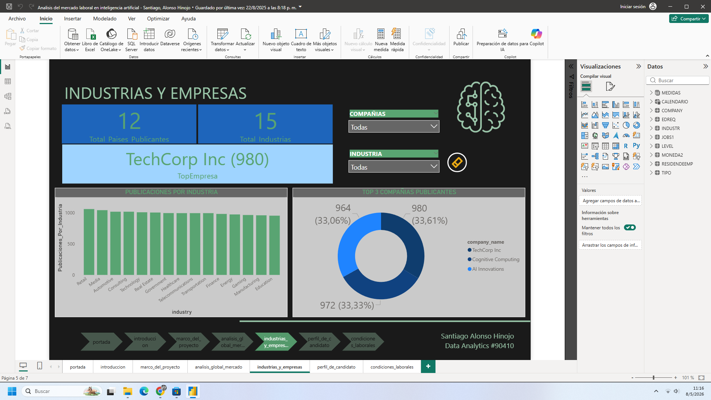
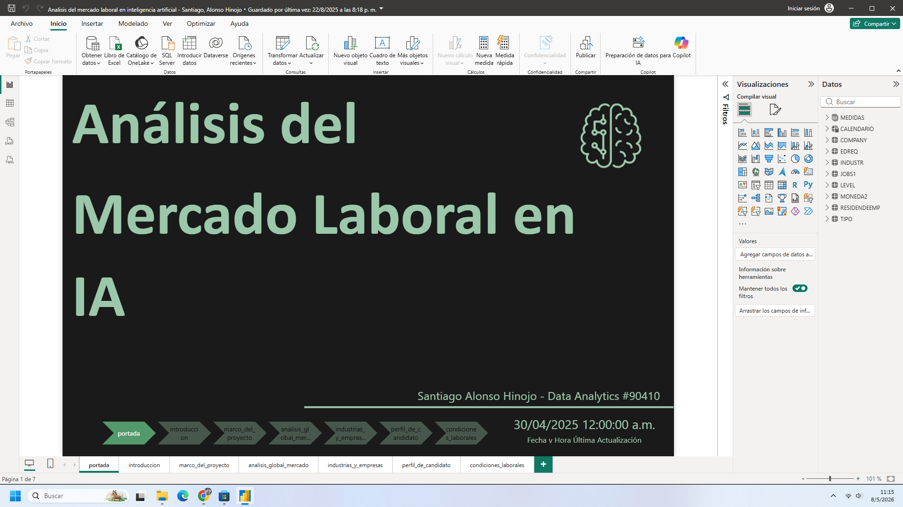

# Análisis del Mercado Laboral en IA 🤖💼

Este proyecto presenta un análisis integral sobre la dinámica de contratación, niveles salariales y condiciones de empleo en el sector de la Inteligencia Artificial a nivel global.

## 📊 Visualización del Proyecto
## 📊 Visualización del Proyecto
A continuación se presentan las capturas del dashboard interactivo desarrollado en Power BI:

## 🎯 Objetivo
El objetivo es transformar datos crudos del sector tecnológico en información estratégica para departamentos de Recursos Humanos y candidatos. El análisis permite comprender patrones de compensación, modalidades de trabajo (remoto vs. presencial) y los requisitos educativos más demandados.

## 🛠️ Tecnologías y Herramientas
* **Power BI:** Modelado de datos y visualización interactiva.
* **DAX:** Creación de medidas calculadas y KPIs.
* **ETL (Power Query):** Limpieza, transformación y normalización de los datasets originales.
* **Análisis Estadístico:** Identificación de tendencias y distribución de variables clave.

## 📁 Estructura del Repositorio
* **`Analisis_Mercado_IA.pbix`**: Archivo original de Power BI con el modelo y dashboard.
* **`Analisis_Mercado_IA.xlsx / .csv`**: Datasets utilizados (originales y transformados).
* **`Documentacion_Proceso.pdf`**: Informe detallado con el marco del proyecto, diagrama entidad-relación y análisis de resultados.

## 📈 Hallazgos Clave
* **Estructura Salarial:** Identificación de brechas según nivel de experiencia y ubicación.
* **Tendencias de Trabajo:** Predominancia de modelos híbridos/remotos en roles de IA.
* **Formación:** Correlación entre niveles académicos avanzados y ofertas de alta especialización.

---
**Santiago Alonso Hinojo** *Ingeniero Mecánico | Data Science & Analytics* [LinkedIn](https://www.linkedin.com/in/santiago-alonso-hinojo/) | [GitHub](https://github.com/SantiagoAlonsoW)
